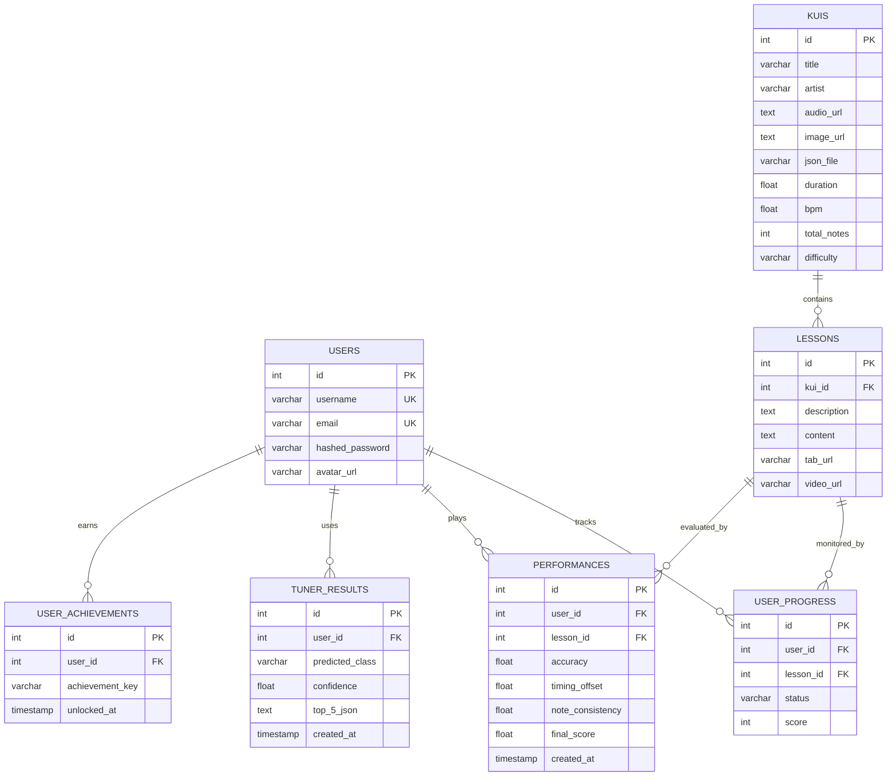

# Kuyshim PostgreSQL Database Schema

This document outlines the PostgreSQL database schema for the Kuyshim backend. It is designed to track users, their learning progress, gameplay performances, and tuner usage.

## Entity-Relationship (ER) Diagram



---

## SQL Initialization Script (DDL)

The following SQL commands represent the structure of the database in PostgreSQL format.

```sql
-- Table: users
CREATE TABLE users (
    id SERIAL PRIMARY KEY,
    username VARCHAR NOT NULL UNIQUE,
    email VARCHAR NOT NULL UNIQUE,
    hashed_password VARCHAR NOT NULL,
    avatar_url VARCHAR
);
CREATE INDEX ix_users_username ON users (username);
CREATE INDEX ix_users_email ON users (email);

-- Table: kuis (Musical compositions)
CREATE TABLE kuis (
    id SERIAL PRIMARY KEY,
    title VARCHAR NOT NULL,
    artist VARCHAR NOT NULL,
    audio_url TEXT NOT NULL,
    image_url TEXT NOT NULL,
    json_file VARCHAR NOT NULL,
    duration FLOAT NOT NULL,
    bpm FLOAT NOT NULL,
    total_notes INTEGER NOT NULL,
    difficulty VARCHAR NOT NULL
);

-- Table: lessons
CREATE TABLE lessons (
    id SERIAL PRIMARY KEY,
    kui_id INTEGER REFERENCES kuis(id) ON DELETE CASCADE,
    description TEXT,
    content TEXT,
    tab_url VARCHAR,
    video_url VARCHAR
);

-- Table: user_progress (Tracks completion of lessons)
CREATE TABLE user_progress (
    id SERIAL PRIMARY KEY,
    user_id INTEGER REFERENCES users(id) ON DELETE CASCADE,
    lesson_id INTEGER REFERENCES lessons(id) ON DELETE CASCADE,
    status VARCHAR DEFAULT 'started',
    score INTEGER
);

-- Table: performances (Tracks detailed gameplay analytics)
CREATE TABLE performances (
    id SERIAL PRIMARY KEY,
    user_id INTEGER REFERENCES users(id) ON DELETE CASCADE,
    lesson_id INTEGER REFERENCES lessons(id) ON DELETE CASCADE,
    accuracy FLOAT NOT NULL,
    timing_offset FLOAT NOT NULL,
    note_consistency FLOAT NOT NULL,
    final_score FLOAT NOT NULL,
    created_at TIMESTAMP DEFAULT CURRENT_TIMESTAMP
);

-- Table: tuner_results (Tracks ML chord recognition history)
CREATE TABLE tuner_results (
    id SERIAL PRIMARY KEY,
    user_id INTEGER REFERENCES users(id) ON DELETE CASCADE,
    predicted_class VARCHAR NOT NULL,
    confidence FLOAT NOT NULL,
    top_5_json TEXT,
    created_at TIMESTAMP DEFAULT CURRENT_TIMESTAMP
);

-- Table: user_achievements (Permanently unlocked milestones)
CREATE TABLE user_achievements (
    id SERIAL PRIMARY KEY,
    user_id INTEGER REFERENCES users(id) ON DELETE CASCADE,
    achievement_key VARCHAR NOT NULL,
    unlocked_at TIMESTAMP DEFAULT CURRENT_TIMESTAMP
);
```

---

## Table Descriptions

1. **`users`**: The core authentication table. Stores credentials and profile information (`avatar_url`).
2. **`kuis`**: Represents the Dombra compositions available in the app. Contains metadata required for the rhythm game engine (BPM, duration, number of notes).
3. **`lessons`**: Represents specific learning materials attached to a `kui`. It can contain textual descriptions, tabs, and video links.
4. **`user_progress`**: A simple many-to-many relationship mapping tracking if a user has "started" or "completed" a lesson.
5. **`performances`**: An analytical table storing the results of every rhythm game session. Used to generate statistics (Average BPM, Note Accuracy) for the user's profile.
6. **`tuner_results`**: Stores the output of the FastAPI ML server. Tracks what chords the user was trying to tune and the model's confidence scores.
7. **`user_achievements`**: Stores permanently unlocked milestones for users (e.g., "Kuishi"). Unlocked based on completion thresholds in the `user_progress` table.
