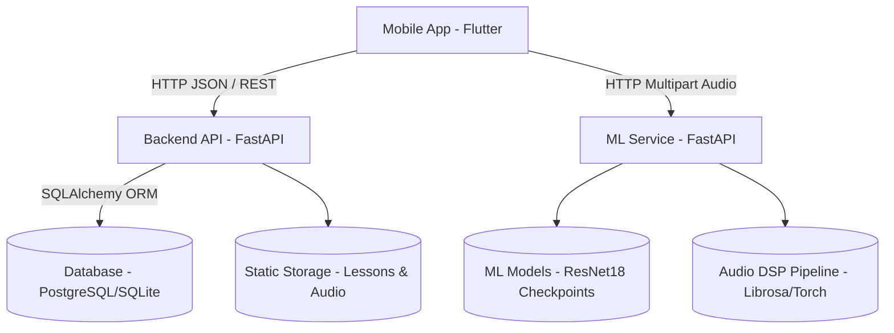

# Kuyshim: System Architecture and Technical Foundation for Dombra Learning Platform

## 1. Introduction and Objectives
The Kuyshim platform is an AI-assisted mobile learning environment specifically designed for the Kazakh dombra. The primary objective is to provide real-time Automatic Music Transcription (AMT) and performance evaluation within a gamified interface. The system leverages machine learning to overcome the unique acoustic challenges of the dombra, particularly its multi-string overlapping harmonics (kuy) and micro-timing playing techniques (strums).

## 2. High-Level System Architecture
The platform is built on a microservices-inspired architecture comprising three distinct tiers:
1. **Client Tier**: A Flutter-based mobile application providing the user interface, rhythm-game mechanics, and audio capture.
2. **Backend Tier**: A FastAPI service managing user authentication, lesson content, progress tracking, and performance persistence.
3. **Machine Learning Tier**: A dedicated FastAPI microservice responsible for real-time audio inference, chord/fret prediction, and performance evaluation.

## 3. Mobile Client Layer (Flutter)
The mobile application serves as the interactive rhythm-game interface for learning dombra.
*   **Framework**: Flutter (Dart) for cross-platform deployment.
*   **State Management**: `Provider` for session-aware application state, local caching, and offline support.
*   **Key Modules**:
    *   **Tuner Flow**: Captures 6-second mono WAV (22050 Hz) and streams it to the ML service for real-time pitch/chord prediction.
    *   **Game Flow**: A rhythm-highway gameplay mode that synchronizes visual notes with lesson audio, calculates local gameplay metrics, and integrates with the backend for score persistence.
    *   **API Clients**: Segmented clients for Backend (`api_service.dart`) and ML Service (`ml_service.dart`).

## 4. Backend Service Layer (FastAPI)
The backend orchestrates business logic and data persistence.
*   **Framework**: FastAPI (Python) for asynchronous request handling.
*   **Database**: PostgreSQL (via Docker) or SQLite for local development, integrated using SQLAlchemy ORM.
*   **Security**: JWT-based authentication (HS256) and bcrypt password hashing.
*   **Core Responsibilities**:
    *   User identity and session management.
    *   Serving lesson metadata and static audio files (`/static`).
    *   Computing and persisting final performance scores.
*   **Scoring Algorithm**: Combines accuracy, timing, and note consistency:
    `Final Score = (Accuracy * 0.5) + ((100 - Timing Offset) * 0.3) + (Note Consistency * 0.2)`

## 5. Machine Learning and Audio Processing Layer
The ML service is the core innovation of the project, functioning as an isolated FastAPI instance optimized for high-throughput audio tensor operations.
*   **Framework**: FastAPI + PyTorch.
*   **Audio DSP Pipeline**:
    *   Ingests raw WAV bytes.
    *   Converts to Mono, 22050 Hz sample rate using `torchaudio`.
    *   Extracts Mel-spectrograms (`n_mels=128`, `n_fft=1024`, `hop_length=256`).
    *   Applies log scaling via `AmplitudeToDB` and z-normalization (zero mean, unit variance).
    *   Pads/trims to fixed 2.0s target length and shapes into a 1-channel tensor `(1, 128, 173)` suitable for CNN ingestion.

## 6. Dataset Preparation and Augmentation Strategy
To accurately classify dombra playing techniques, a robust dataset augmentation pipeline was implemented to simulate realistic playing conditions. This pipeline is critical for training a robust multi-label classification model.
*   **Raw Data**: Hand-segmented recordings of individual notes and chords.
*   **Synthetic Interval Generation**: To model traditional "Kuy" music, open string drone samples are programmatically combined with fretted note samples.
*   **Micro-Delay "Strum" Effects**: Rather than perfectly synchronous notes, random micro-delays (e.g., 10-30ms) are introduced between the drone and the fretted note to simulate human strumming dynamics.
*   **Audio Normalization**: RMS-based normalization ensures consistent volume across augmented samples, crucial for robust spectrogram generation.
*   **Multi-Label Setup**: The dataset is prepared for multi-label classification, ensuring the model can accurately distinguish overlapping harmonics characteristic of the instrument.

## 7. Model Architecture and Training
The Automatic Music Transcription (AMT) model is designed to detect precise instrument frets under varied playing conditions.
*   **Backbone**: A pre-trained `ResNet18` Convolutional Neural Network (CNN) architecture.
*   **Transfer Learning**: The network is adapted by modifying the input convolutional layer from 3 channels (RGB image) to 1 channel (Spectrogram). A `Dropout(p=0.5)` layer is added to reduce overfitting, and the final fully connected (FC) layer is replaced to output raw logits matching the Dombra's 38 target classes.
*   **Fine-Tuning Strategy**: The ResNet18 backbone is systematically unfrozen, allowing the model to learn domain-specific audio features from the dombra dataset. Training employs `BCEWithLogitsLoss` optimized for multi-label classification.
*   **Evaluation Metric**: The model is optimized for **Macro F1 Score** on unseen audio data, ensuring balanced classification accuracy across all frets and techniques.

## 8. Performance Evaluation Pipeline
The system evaluates user playing against reference audio through multi-faceted Digital Signal Processing (DSP) metrics:
1.  **Chroma Similarity**: Measures pitch accuracy by extracting and comparing the chromagrams of user and reference audio.
2.  **Timing Offset**: An onset-based algorithm calculates the temporal deviation between user strikes and reference strikes.
3.  **Note Consistency**: Evaluates spectral flatness and RMS energy variation to determine tonal stability and playing consistency.
4.  **Consolidated Feedback**: These metrics are aggregated and returned via the `/evaluate` HTTP endpoint for mobile consumption.

## 9. Security, Deployment, and Operations
*   **Containerization**: Docker and Docker Compose orchestrate the PostgreSQL database, FastAPI backend, and ML services.
*   **Network Flow**: Mobile emulator environments proxy requests through `10.0.2.2` to the host machine running the FastAPI instances (`:8000` and `:8001`).
*   **Storage Architecture**: Segmented persistent storage for raw recordings, processed ML features, trained model checkpoints (`.pth` files), and static user lesson content.
